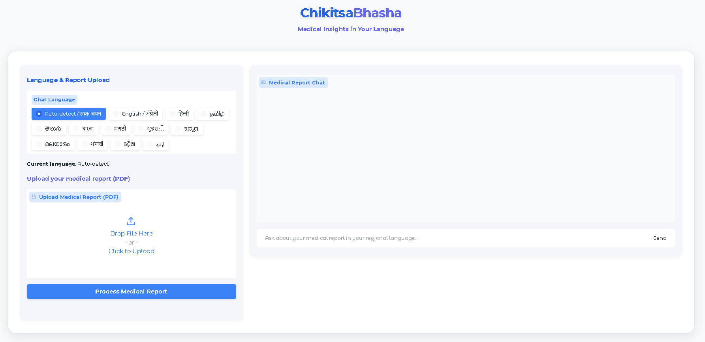

# ChikitsaBhasha — Medical Insights in Your Language 🇮🇳

**ChikitsaBhasha** is an AI-powered multilingual medical assistant that explains complex medical reports in **simple, understandable language** — in your **preferred Indian language**. Built using **RAG (Retrieval-Augmented Generation)** and **Google Gemini**, this project aims to make healthcare communication more **inclusive, accessible, and personalized**.


---

## ✨ Features

* 📄 **PDF Medical Report Reader**
  Upload medical reports (digital or scanned) and extract content using OCR + NLP.

* 🔍 **RAG-Based Reasoning**
  Uses sentence-transformer embeddings + Pinecone vector DB for relevant context retrieval.

* 🧠 **Gemini API Integration**
  Generates clear, medically-informed explanations using Google’s Gemini 2.5 model.

* 🗣️ **Multilingual Support**
  Supports 12 Indian languages like Hindi, Tamil, Telugu, Kannada, Bengali, Marathi, and more.

* 💬 **Interactive Chat Interface**
  Ask questions about your medical report and get human-friendly explanations.

---

## 🧪 Example Use Cases

> Upload a medical report and ask:

* “Explain this in Telugu.”
* “What does high creatinine mean?”
* “Is this report normal or dangerous?”
* “Translate this in Marathi for my grandparents.”

---

## ⚙️ Project Flow: How It Works

1. **Upload a PDF Medical Report**
   The user uploads a scanned or digital PDF. If text cannot be extracted, OCR is used as fallback.

2. **Text Extraction and Chunking**
   The PDF is parsed, and its content is split into overlapping text chunks.

3. **Embedding Creation**
   Each chunk is embedded using a Sentence Transformer (MiniLM) and stored in Pinecone.

4. **User Asks a Question**
   The user types a question about the report in any Indian language or lets the system auto-detect.

5. **Query Embedding + Vector Search**
   The user's question is embedded and matched against the most relevant chunks in Pinecone.

6. **Gemini Response Generation**
   The retrieved context and user query are sent to Gemini 2.5 for an answer in English.

7. **Translation to Target Language**
   If the selected language is not English, the response is translated using Google Translate API.

8. **Response Delivery via Chatbot UI**
   The user sees the final answer with language tag and chat history.

> 🔹 Built with empathy for patients across linguistic borders.

---

## 🚀 Getting Started

### 🛠 Prerequisites

* Python 3.10+
* Tesseract OCR installed
* Environment variables in `.env`:

  * `GOOGLE_API_KEY`
  * `PINECONE_API_KEY`

### 📦 Installation

```bash
git clone https://github.com/yourusername/chikitsabhasha.git
cd chikitsabhasha
pip install -r requirements.txt
```

### ▶️ Run the App

```bash
python app.py
```

Visit `http://localhost:7860` in your browser.

---

## 🧰 Tech Stack

| Component                | Purpose                             |
| ------------------------ | ----------------------------------- |
| Gradio                   | UI framework for interaction        |
| Gemini API (Google)      | LLM for answering questions         |
| Pinecone                 | Vector DB for RAG context retrieval |
| Sentence Transformers    | Embedding generation                |
| PyPDF2 + OCR (Tesseract) | PDF text extraction                 |

---

## 📬 Author

**N Punith Kumar**
📧 Email: [punithkumarnimmala@gmail.com](mailto:punithkumarnimmala@gmail.com)
🔗 GitHub: [@punithkumar-10](https://github.com/punithkumar-10)

---

## 🙏 Acknowledgements

* [Google Generative AI](https://ai.google.dev/)
* [Pinecone Vector DB](https://www.pinecone.io/)
* [Gradio UI](https://www.gradio.app/)
* [Tesseract OCR](https://github.com/tesseract-ocr)

---
## 🌐 Supported Languages

* English (en)
* Hindi (hi)
* Tamil (ta)
* Telugu (te)
* Bengali (bn)
* Marathi (mr)
* Gujarati (gu)
* Kannada (kn)
* Malayalam (ml)
* Punjabi (pa)
* Oriya (or)
* Urdu (ur)
